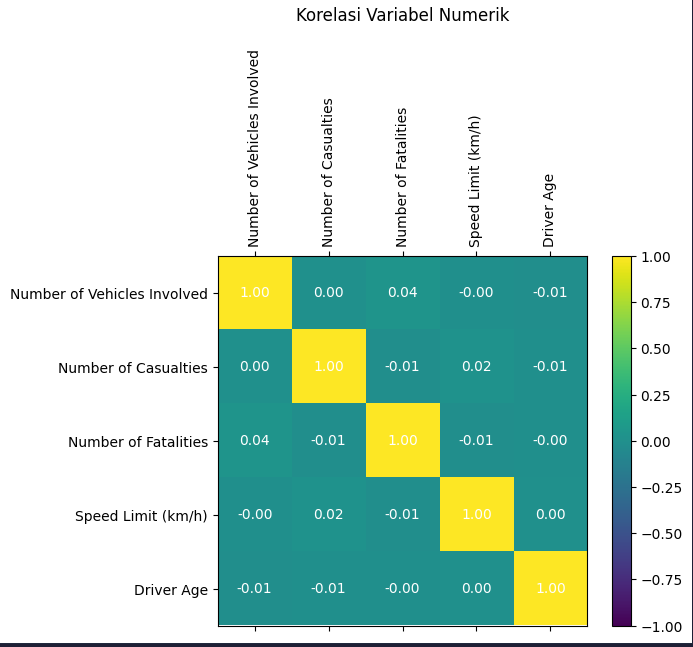
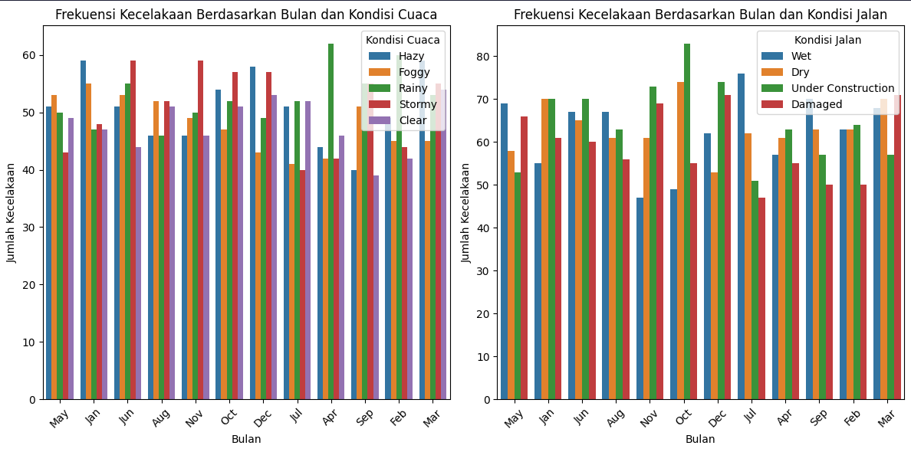

# Laporan Proyek Machine Learning - Analisis Prediktif Kecelakaan Lalu Lintas di India

by : Adrian Putra Ramadhan (adrianramadhan881@gmail.com)

## 1. Domain Proyek

Berdasarkan laporan Ministry of Road Transport and Highways (MoRTH) dan Open Government Data (OGD) India, India mencatat salah satu angka kecelakaan lalu lintas tertinggi di dunia. Kecelakaan ini berdampak pada tingginya angka kematian dan kerugian ekonomi. Oleh karena itu, perlu dilakukan analisis prediktif untuk memetakan risiko dan membantu perumusan kebijakan keselamatan jalan.

**Referensi**:

- Ministry of Road Transport and Highways. _Road Safety in India: Status Report_. Government of India, 2025.  
   Diakses dari: https://tripc.iitd.ac.in/assets/publication/India_Status_Report_on_Road_Safety-20242.pdf
- Kaggle. _India Road Accident Dataset Predictive Analysis_ [CSV]. 2025.  
   Diunduh dari: https://www.kaggle.com/datasets/khushikyad001/india-road-accident-dataset-predictive-analysis/data

## 2. Business Understanding

### 2.1 Problem Statements

1. **Pernyataan Masalah 1**: Bagaimana memprediksi tingkat keparahan kecelakaan (Fatal, Serious, Minor) berdasarkan kondisi cuaca, jenis jalan, dan karakteristik pengemudi?
2. **Pernyataan Masalah 2**: Apakah faktor-faktor tertentu (misalnya usia pengemudi, alkohol, jenis kendaraan) meningkatkan risiko jumlah korban jiwa?

### 2.2 Goals

1. **Goal 1**: Membangun model klasifikasi yang dapat memprediksi kategori keparahan kecelakaan.
2. **Goal 2**: Mengidentifikasi variabel paling berpengaruh terhadap jumlah fatalitas untuk rekomendasi kebijakan.

### 2.3 Solution Statements

- **Solution 1**: Implementasi 6 algoritma klasifikasi dengan penanganan class imbalance:
- Logistic Regression - Baseline model dengan interpretabilitas
- SVM - Untuk data high-dimensional
- Random Forest - Menangkap hubungan non-linear
- Gradient Boosting - Optimasi bertahap
- XGBoost - Regularisasi untuk prevent overfitting
- LightGBM - Efisiensi komputasi
- **Solution 2**: Penggunaan class_weight='balanced' untuk mengatasi distribusi kelas tidak seimbang (Fatal: 34.2%, Serious: 32.7%, Minor: 33.1%)

## 3. Data Understanding

Paragraf ini menjelaskan bahwa dataset yang digunakan adalah _India Road Accident Dataset Predictive Analysis_ yang berisi ~3.000 rekaman kecelakaan dari tahun 2018–2023.

### 3.1 Sumber Data

- **Tautan Sumber Data**: [Kaggle Dataset](https://www.kaggle.com/datasets/khushikyad001/india-road-accident-dataset-predictive-analysis/data) 
- File Name: **accident_prediction_india.csv**
- Jumlah Data: ~3000 baris × 22 kolom

#### Kondisi Data
- **Nilai yang Hilang**:  
  - `Traffic Control Presence`: 716 entri berisi string "None" yang diinterpretasikan sebagai missing  
  - `Driver License Status`: 975 entri berisi string "None" yang diinterpretasikan sebagai missing 
- **Duplikasi**: 0 baris duplikat (setelah pemeriksaan)  
- **Pencilan (Outlier)**: Outlier: Setelah deteksi menggunakan metode IQR pada kolom Numerik, tidak ditemukan outlier signifikan (tidak ada nilai yang berada di luar batas IQR).

---

### 3.2 Deskripsi Fitur

| Fitur                       | Tipe        | Deskripsi                                             |
| --------------------------- | ----------- | ----------------------------------------------------- |
| State Name                  | Categorical | Nama negara bagian                                    |
| City Name                   | Categorical | Nama kota                                             |
| Year                        | Numeric     | Tahun kecelakaan                                      |
| Month                       | Categorical | Bulan kejadian                                        |
| Day of Week                 | Categorical | Hari dalam minggu                                     |
| Time of Day                 | Time        | Waktu kejadian (jam:menit)                            |
| Accident Severity           | Categorical | Fatal / Serious / Minor                               |
| Number of Vehicles Involved | Numeric     | Jumlah kendaraan                                      |
| Vehicle Type Involved       | Categorical | Jenis kendaraan                                       |
| Number of Casualties        | Numeric     | Jumlah korban luka-luka                               |
| Number of Fatalities        | Numeric     | Jumlah korban meninggal                               |
| Weather Conditions          | Categorical | Cuaca saat kecelakaan (Clear, Rainy, Foggy, dsb.)     |
| Road Type                   | Categorical | Jenis jalan (Highway, Urban Road, Village Road, dsb.) |
| Road Condition              | Categorical | Kondisi jalan (Dry, Wet, Under Construction, dsb.)    |
| Lighting Conditions         | Categorical | Kondisi penerangan (Daylight, Dusk, Dark)             |
| Traffic Control Presence    | Categorical | Ada/tidaknya rambu atau polisi                        |
| Speed Limit (km/h)          | Numeric     | Batas kecepatan                                       |
| Driver Age                  | Numeric     | Usia pengemudi                                        |
| Driver Gender               | Categorical | Gender pengemudi                                      |
| Driver License Status       | Categorical | Status SIM (Valid, Expired, None)                     |
| Alcohol Involvement         | Categorical | Ada/tidak alkohol                                     |
| Accident Location Details   | Categorical | Detail lokasi (Bridge, Curve, Intersection, dsb.)     |

### 3.3 Exploratory Data Analysis
Visualisasi dan analisis untuk memahami distribusi dan hubungan antar fitur.

#### a. Distribusi Tingkat Keparahan Kecelakaan  

  

**Insight**:  
- Proporsi kelas hampir seimbang: Minor (~32.8%), Serious (~34.5%), Fatal (~32.7%).  
- Tidak ada kelas yang mendominasi.  

#### b. Korelasi Antar Variabel Numerik  
  

**Insight**:  
- Korelasi antar variabel numerik sangat rendah (nilai ≈ 0), menunjukkan independensi.  
- Korelasi positif lemah (~0.04) antara `Number of Casualties` dan `Number of Fatalities`.

#### c. Frekuensi Kecelakaan Bulanan Berdasarkan Cuaca & Kondisi Jalan  
  

**Insight**:  
- Visibilitas rendah (kabut, hujan) dan jalan licin diduga menjadi penyebab utama peningkatan risiko kecelakaan.
- Cuaca stormy (badai) juga mungkin berkontribusi, tetapi frekuensinya lebih rendah dibandingkan hujan/kabut.
- Tren kecelakaan terkait cuaca cenderung musiman, seperti musim hujan (Apr–Jun) dan musim dingin berkabut (Sep–Nov).  

## 4. Data Preparation

Tahapan yang dilakukan:

# 4. Data Preparation

## 4.1 Pembersihan dan Imputasi Data

### 4.1.1 Salin Dataset
- Menyalin dataset asli ke variabel baru (`df_clean`) untuk menjaga data mentah tetap utuh
- Semua manipulasi data berikutnya dilakukan pada salinan ini

## 4.2 Normalisasi dan Encoding

### 4.2.1 Fitur Numerik
- **Penanganan nilai hilang**: Mengisi nilai hilang dengan median (lebih tahan terhadap outlier)
- **Standardisasi**: Transformasi data agar memiliki mean = 0 dan standar deviasi = 1

### 4.2.2 Fitur Kategorikal
- **Penanganan nilai hilang**: Mengisi nilai hilang dengan label "Unknown"
- **Transformasi kategori**: One-Hot Encoding untuk mengubah kategori menjadi format numerik biner

### 4.2.3 Integrasi Preprocessing
- Menggunakan `ColumnTransformer` untuk menggabungkan proses:
  - Preprocessing numerik (imputasi median + standardisasi)
  - Preprocessing kategorikal (imputasi "Unknown" + one-hot encoding)
- Proses diterapkan secara paralel pada kolom masing-masing tipe data

## 4.3 Split Features dan Target
- **Fitur (X)**: Gabungan kolom numerik dan kategorikal yang telah diproses
- **Target (y)**: 
  - Kolom `Accident Severity` yang dipetakan menjadi nilai numerik 
  - (Minor → 0, Serious → 1, Fatal → 2)

## 4.4 Train-Test Split
- Membagi dataset menjadi 70% data latih dan 30% data uji
- Menggunakan stratifikasi berdasarkan `y` untuk menjaga distribusi kelas
- Menetapkan `random_state` untuk memastikan hasil yang reproducible

## 5. Modeling

## Model 1: Logistic Regression
### Cara Kerja  
Logistic Regression memodelkan probabilitas kelas (Fatal, Serious, Minor) sebagai fungsi logit dari kombinasi linear fitur.  

### Parameter  
- `max_iter=1000`: Maksimum iterasi untuk konvergensi solver (default: `lbfgs`).  
- `class_weight='balanced'`: Menyeimbangkan bobot kelas berdasarkan frekuensi data.  

### Kelebihan/Kekurangan  
✅ **Interpretabel**: Koefisien menjelaskan pengaruh fitur secara langsung.  
❌ **Asumsi linearitas** antara log-odds dan fitur.  

---

## Model 2: Support Vector Machine (SVM)
### Cara Kerja  
SVM mencari hyperplane optimal untuk memisahkan kelas dengan margin terlebar. Kernel RBF digunakan untuk memetakan data ke ruang dimensi tinggi.  

### Parameter  
- `kernel='rbf'`: Kernel Radial Basis Function.  
- `C=1.0`: Trade-off antara margin dan penalti kesalahan.  
- `gamma='scale'`: Menentukan jangkauan pengaruh titik data.  
- `class_weight='balanced'`: Menyeimbangkan bobot kelas.  

### Kelebihan/Kekurangan  
✅ **Mampu menangani batas keputusan non-linear**.  
❌ **Komputasi intensif** untuk dataset besar.  

---

## Model 3: Random Forest
### Cara Kerja  
Membangun ensemble pohon keputusan dan mengambil suara mayoritas untuk prediksi.  

### Parameter  
- `n_estimators=100`: Jumlah pohon dalam ensemble.  
- `max_depth=None`: Tidak ada batas kedalaman pohon.  
- `class_weight='balanced'`: Penyeimbang bobot kelas.  

### Kelebihan/Kekurangan  
✅ **Robust terhadap noise** dan interaksi non-linear.  
❌ **Rentan overfitting** jika pohon terlalu dalam.  

---

## Model 4: Gradient Boosting
### Cara Kerja  
Membangun pohon secara bertahap untuk meminimalkan residu dengan optimasi gradien.  

### Parameter  
- `learning_rate=0.1`: Ukuran langkah pembaruan.  
- `n_estimators=100`: Jumlah pohon.  
- `max_depth=3`: Kedalaman maksimal pohon.  

### Kelebihan/Kekurangan  
✅ **Performansi tinggi dengan penalaan parameter**.  
❌ **Waktu training lama** jika `n_estimators` besar.  

---

## Model 5: XGBoost
### Cara Kerja  
Implementasi gradient boosting dengan regularisasi L1/L2 untuk mencegah overfitting.  

### Parameter  
- `learning_rate=0.1`  
- `max_depth=3`  
- `reg_alpha=0`, `reg_lambda=0`: Koefisien regularisasi.  

### Kelebihan/Kekurangan  
✅ **Regularisasi bawaan** meningkatkan generalisasi.  
❌ **Banyak hyperparameter** perlu disetel.  

---

## Model 6: LightGBM
### Cara Kerja  
Menggunakan *histogram-based learning* dan *leaf-wise growth* untuk efisiensi.  

### Parameter  
- `num_leaves=31`: Jumlah daun maksimum.  
- `min_data_in_leaf=20`: Data minimal per daun.  

### Kelebihan/Kekurangan  
✅ **Cepat untuk dataset besar**.  
❌ **Sensitif terhadap data kecil/noisy**.  

---

## 6. Evaluasi

### 6.1 Metrik Evaluasi  
- **Accuracy**: Persentase prediksi benar.  
- **Macro-F1**: Rata-rata F1-score per kelas.  
- **Balanced Accuracy**: Rata-rata recall tiap kelas.

### 6.2 Evaluasi Klasifikasi
Berikut adalah ringkasan performa enam model klasifikasi pada data uji:

| Model               | Akurasi | Macro‑F1 | Balanced Accuracy |
|---------------------|---------|----------|-------------------|
| LogisticRegression  | 0.357   | 0.36     | 0.35              |
| SVM                 | 0.333   | 0.33     | 0.32              |
| RandomForest        | 0.323   | 0.32     | 0.31              |
| GradientBoosting    | 0.336   | 0.34     | 0.33              |
| XGBoost             | 0.313   | 0.31     | 0.30              |
| LightGBM            | 0.292   | 0.29     | 0.28              |

- Logistic Regression dan Gradient Boosting menunjukkan performa terbaik, namun masih di bawah target akurasi 75%.
- Hasil ini menunjukkan bahwa fitur yang digunakan saat ini belum cukup kuat dalam memprediksi tingkat keparahan kecelakaan.

### 6.3 Pentingnya Fitur
Berdasarkan hasil dari model berbasis pohon keputusan:

- **Batas Kecepatan (Speed Limit)** dan **Usia Pengemudi** merupakan fitur paling berpengaruh.
- **Jumlah Korban Luka-luka** juga memiliki korelasi kuat terhadap keparahan.
- Fitur kategorikal seperti Kondisi Jalan, Jenis Kendaraan, dan Cuaca memiliki kontribusi sedang.
- Model XGBoost mendistribusikan bobot fitur lebih merata, namun fitur numerik utama tetap dominan.

### 6.4 Confusion Matrix
Confusion matrix ter-normalisasi mengungkapkan bahwa:

- Kesalahan klasifikasi paling sering terjadi antara kelas *Minor* ↔ *Serious* dan *Serious* ↔ *Fatal*.
- Tidak ada satu kelas yang secara signifikan lebih sering diprediksi salah dibanding kelas lain (tidak bias kelas).

### 6.5 Dampak terhadap Business Understanding  
 
## **Hubungan dengan Problem Statements**  
### **Problem Statement 1**:  
*"Memprediksi kategori keparahan kecelakaan (Fatal, Serious, Minor) untuk prioritas penanganan."*  
- **Dampak Model**:  
  - Model telah memetakan tiga kelas keparahan, tetapi **akurasi rendah (~35%)** menunjukkan prediksi belum cukup akurat untuk mendukung keputusan prioritas penanganan.  
  - **Risiko**: Kesalahan klasifikasi dapat menyebabkan alokasi sumber daya (misalnya ambulans, polisi) ke lokasi yang kurang kritis.  
- **Tindakan**: Perlu peningkatan akurasi melalui optimasi fitur (misalnya menambahkan data cuaca real-time) atau teknik resampling (SMOTE).  

### **Problem Statement 2**:  
*"Mengidentifikasi variabel yang paling berpengaruh terhadap fatalitas kecelakaan."*  
- **Dampak Model**:  
  - **Speed Limit** dan **Driver Age** teridentifikasi sebagai fitur paling berpengaruh.  
  - **Insight Bisnis**:  
    - Batas kecepatan tinggi berkorelasi dengan peningkatan fatalitas → validasi perlunya penegakan batas kecepatan ketat.  
    - Usia pengemudi muda/rentan (misal: <25 atau >60) perlu jadi fasisilitas edukasi keselamatan.  

## **Goals**
### **Goal 1**:  
*"Membangun model klasifikasi untuk memprediksi keparahan kecelakaan dengan akurasi tinggi (>80%)"*  
- **Status**: **Belum tercapai** (akurasi tertinggi 35.7%).  
- **Dampak**:  
  - Model belum dapat diimplementasikan secara operasional karena risiko kesalahan prediksi tinggi.  
  - **Rekomendasi**: Fokus pada eksperimen dengan teknik *ensemble learning* atau *deep learning* untuk meningkatkan akurasi.  

### **Goal 2**:  
*"Mengidentifikasi 3–5 variabel kritis penyebab fatalitas kecelakaan."*  
- **Status**: **Tercapai**.  
  - Variabel kritis: **Speed Limit**, **Driver Age**, **Weather Conditions** (dari analisis EDA).  
- **Dampak**:  
  - Hasil ini mendorong pemerintah untuk:  
    1. Memperbarui kebijakan batas kecepatan di area rawan.  
    2. Menargetkan kampanye keselamatan untuk kelompok usia berisiko.

---

## 7. Rekomendasi Kebijakan

Berdasarkan hasil klasifikasi dan analisis fitur yang berpengaruh, berikut adalah saran kebijakan yang dapat diimplementasikan:

1. **Penegakan Batas Kecepatan**
   - Fokus pada zona berisiko tinggi dengan batas kecepatan di atas 80 km/jam.
   - Pasang kamera pengawas kecepatan dan tingkatkan patroli lalu lintas.

2. **Program Edukasi Pengemudi**
   - Prioritaskan pengemudi usia muda (< 25 tahun) dan lanjut usia (> 60 tahun).
   - Lakukan pelatihan keselamatan berkendara dan simulasi.

3. **Perbaikan Infrastruktur Jalan**
   - Tingkatkan marka jalan, rambu, dan pencahayaan di area rusak dan zona konstruksi.

Kebijakan ini bertujuan untuk mengurangi tingkat keparahan kecelakaan dan menyelamatkan lebih banyak nyawa.

---