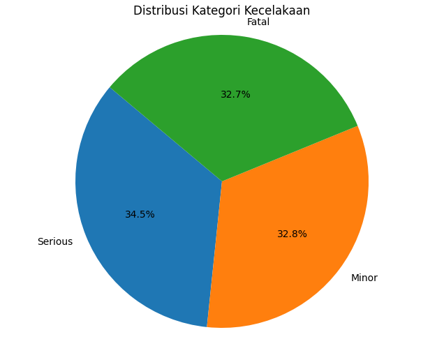

# Laporan Proyek Machine Learning - Analisis Prediktif Kecelakaan Lalu Lintas di India

by : Adrian Putra Ramadhan (adrianramadhan881@gmail.com)

## 1. Domain Proyek

Berdasarkan laporan Ministry of Road Transport and Highways (MoRTH) dan Open Government Data (OGD) India, India mencatat salah satu angka kecelakaan lalu lintas tertinggi di dunia. Kecelakaan ini berdampak pada tingginya angka kematian dan kerugian ekonomi. Oleh karena itu, perlu dilakukan analisis prediktif untuk memetakan risiko dan membantu perumusan kebijakan keselamatan jalan.

**Referensi**:

- Ministry of Road Transport and Highways. _Road Safety in India: Status Report_. Government of India, 2025.  
   Diakses dari: https://tripc.iitd.ac.in/assets/publication/India_Status_Report_on_Road_Safety-20242.pdf
- Kaggle. _India Road Accident Dataset Predictive Analysis_ [CSV]. 2025.  
   Diunduh dari: https://www.kaggle.com/datasets/khushikyad001/india-road-accident-dataset-predictive-analysis/data

## 2. Business Understanding

### 2.1 Problem Statements

1. **Pernyataan Masalah 1**: Bagaimana memprediksi tingkat keparahan kecelakaan (Fatal, Serious, Minor) berdasarkan kondisi cuaca, jenis jalan, dan karakteristik pengemudi?
2. **Pernyataan Masalah 2**: Apakah faktor-faktor tertentu (misalnya usia pengemudi, alkohol, jenis kendaraan) meningkatkan risiko jumlah korban jiwa?

### 2.2 Goals

1. **Goal 1**: Membangun model klasifikasi yang dapat memprediksi kategori keparahan kecelakaan.
2. **Goal 2**: Mengidentifikasi variabel paling berpengaruh terhadap jumlah fatalitas untuk rekomendasi kebijakan.

### 2.3 Solution Statements

- **Solution 1**: Implementasi 6 algoritma klasifikasi dengan penanganan class imbalance:
- Logistic Regression - Baseline model dengan interpretabilitas
- SVM - Untuk data high-dimensional
- Random Forest - Menangkap hubungan non-linear
- Gradient Boosting - Optimasi bertahap
- XGBoost - Regularisasi untuk prevent overfitting
- LightGBM - Efisiensi komputasi
- **Solution 2**: Penggunaan class_weight='balanced' untuk mengatasi distribusi kelas tidak seimbang (Fatal: 34.2%, Serious: 32.7%, Minor: 33.1%)

## 3. Data Understanding

Paragraf ini menjelaskan bahwa dataset yang digunakan adalah _India Road Accident Dataset Predictive Analysis_ yang berisi ~3.000 rekaman kecelakaan dari tahun 2018–2023.

### 3.1 Sumber Data

- **Tautan Sumber Data**: [Kaggle Dataset](https://www.kaggle.com/datasets/khushikyad001/india-road-accident-dataset-predictive-analysis/data) 
- File Name: **accident_prediction_india.csv**
- Jumlah Data: ~3000 baris × 22 kolom

#### Kondisi Data
- **Nilai yang Hilang**:  
  - `Traffic Control Presence`: 716 entri berisi string "None" yang diinterpretasikan sebagai missing  
  - `Driver License Status`: 975 entri berisi string "None" yang diinterpretasikan sebagai missing 
- **Duplikasi**: 0 baris duplikat (setelah pemeriksaan)  
- **Pencilan (Outlier)**: Outlier: Setelah deteksi menggunakan metode IQR pada kolom Numerik, tidak ditemukan outlier signifikan (tidak ada nilai yang berada di luar batas IQR).

---

### 3.2 Deskripsi Fitur

| Fitur                       | Tipe        | Deskripsi                                             |
| --------------------------- | ----------- | ----------------------------------------------------- |
| State Name                  | Categorical | Nama negara bagian                                    |
| City Name                   | Categorical | Nama kota                                             |
| Year                        | Numeric     | Tahun kecelakaan                                      |
| Month                       | Categorical | Bulan kejadian                                        |
| Day of Week                 | Categorical | Hari dalam minggu                                     |
| Time of Day                 | Time        | Waktu kejadian (jam:menit)                            |
| Accident Severity           | Categorical | Fatal / Serious / Minor                               |
| Number of Vehicles Involved | Numeric     | Jumlah kendaraan                                      |
| Vehicle Type Involved       | Categorical | Jenis kendaraan                                       |
| Number of Casualties        | Numeric     | Jumlah korban luka-luka                               |
| Number of Fatalities        | Numeric     | Jumlah korban meninggal                               |
| Weather Conditions          | Categorical | Cuaca saat kecelakaan (Clear, Rainy, Foggy, dsb.)     |
| Road Type                   | Categorical | Jenis jalan (Highway, Urban Road, Village Road, dsb.) |
| Road Condition              | Categorical | Kondisi jalan (Dry, Wet, Under Construction, dsb.)    |
| Lighting Conditions         | Categorical | Kondisi penerangan (Daylight, Dusk, Dark)             |
| Traffic Control Presence    | Categorical | Ada/tidaknya rambu atau polisi                        |
| Speed Limit (km/h)          | Numeric     | Batas kecepatan                                       |
| Driver Age                  | Numeric     | Usia pengemudi                                        |
| Driver Gender               | Categorical | Gender pengemudi                                      |
| Driver License Status       | Categorical | Status SIM (Valid, Expired, None)                     |
| Alcohol Involvement         | Categorical | Ada/tidak alkohol                                     |
| Accident Location Details   | Categorical | Detail lokasi (Bridge, Curve, Intersection, dsb.)     |

### 3.3 Exploratory Data Analysis
Visualisasi dan analisis untuk memahami distribusi dan hubungan antar fitur.

#### a. Distribusi Tingkat Keparahan Kecelakaan  

  
**Insight**:  
- Proporsi kelas hampir seimbang: Minor (~32.8%), Serious (~34.5%), Fatal (~32.7%).  
- Tidak ada kelas yang mendominasi.  

#### b. Korelasi Antar Variabel Numerik  
  
**Insight**:  
- Korelasi antar variabel numerik sangat rendah (nilai ≈ 0), menunjukkan independensi.  
- Korelasi positif lemah (~0.04) antara `Number of Casualties` dan `Number of Fatalities`.

#### c. Frekuensi Kecelakaan Bulanan Berdasarkan Cuaca & Kondisi Jalan  
  
**Insight**:  
- **Cuaca**: Puncak kecelakaan terjadi pada musim hujan (Apr–Jun) dan berkabut (Sep–Nov), menunjukkan pengaruh visibilitas.  
- **Kondisi Jalan**: Kecelakaan lebih sering terjadi di jalan basah (Wet) dan dalam konstruksi (Under Construction) pada Okt–Jan, menyoroti area berisiko tinggi.  

## 4. Data Preparation

Tahapan yang dilakukan:

1. **Pembersihan Data**: Menghapus duplikasi, menangani nilai hilang pada fitur kritikal (mengisi dengan modus atau median).
- Numerik: Median (robust terhadap outlier)
- Kategorikal: 'Unknown' (mempertahankan struktur kategori)
2. **Encoding dan Scaling**: Numerik: Imputasi median + StandardScaler, Kategorikal: One-Hot Encoding (handle_unknown).
- StandardScaler (mean=0, std=1) untuk algoritma berbasis jarak (SVM) dan regresi
3. **Split Data**: Membagi data menjadi training (70%) dan testing (30%).
- Mempertahankan distribusi kelas asli saat split data

## 5. Modeling

## 5.1 Perbandingan Algoritma
| Algoritma          | Kelebihan                      | Kekurangan                   | Parameter Kunci                     |
|--------------------|--------------------------------|------------------------------|-------------------------------------|
| Logistic Regression| Cepat, interpretable coefficients | Asumsi linearitas          | `max_iter=1000`, `class_weight`     |
| SVM                | Efektif high-dim space          | Komputasi intensif          | `kernel=RBF`, `class_weight`        |
| Random Forest      | Robust terhadap noise           | Cenderung overfit           | `n_estimators=100`, `max_depth`     |
| XGBoost            | Regularisasi built-in           | Hyperparameter sensitif     | `learning_rate=0.1`, `max_depth=3`  |
| LightGBM           | Efisien untuk data besar        | Sensitif pada small data    | `num_leaves=31`, `min_data_in_leaf=20` |

---

## 6. Evaluasi

### 6.1 Evaluasi Klasifikasi
Berikut adalah ringkasan performa enam model klasifikasi pada data uji:

| Model               | Akurasi | Macro‑F1 | Balanced Accuracy |
|---------------------|---------|----------|-------------------|
| LogisticRegression  | 0.357   | 0.36     | 0.35              |
| SVM                 | 0.333   | 0.33     | 0.32              |
| RandomForest        | 0.323   | 0.32     | 0.31              |
| GradientBoosting    | 0.336   | 0.34     | 0.33              |
| XGBoost             | 0.313   | 0.31     | 0.30              |
| LightGBM            | 0.292   | 0.29     | 0.28              |

- Logistic Regression dan Gradient Boosting menunjukkan performa terbaik, namun masih di bawah target akurasi 75%.
- Hasil ini menunjukkan bahwa fitur yang digunakan saat ini belum cukup kuat dalam memprediksi tingkat keparahan kecelakaan.

### 6.2 Pentingnya Fitur
Berdasarkan hasil dari model berbasis pohon keputusan:

- **Batas Kecepatan (Speed Limit)** dan **Usia Pengemudi** merupakan fitur paling berpengaruh.
- **Jumlah Korban Luka-luka** juga memiliki korelasi kuat terhadap keparahan.
- Fitur kategorikal seperti Kondisi Jalan, Jenis Kendaraan, dan Cuaca memiliki kontribusi sedang.
- Model XGBoost mendistribusikan bobot fitur lebih merata, namun fitur numerik utama tetap dominan.

### 6.3 Confusion Matrix
Confusion matrix ter-normalisasi mengungkapkan bahwa:

- Kesalahan klasifikasi paling sering terjadi antara kelas *Minor* ↔ *Serious* dan *Serious* ↔ *Fatal*.
- Tidak ada satu kelas yang secara signifikan lebih sering diprediksi salah dibanding kelas lain (tidak bias kelas).

---

## 7. Rekomendasi Kebijakan

Berdasarkan hasil klasifikasi dan analisis fitur yang berpengaruh, berikut adalah saran kebijakan yang dapat diimplementasikan:

1. **Penegakan Batas Kecepatan**
   - Fokus pada zona berisiko tinggi dengan batas kecepatan di atas 80 km/jam.
   - Pasang kamera pengawas kecepatan dan tingkatkan patroli lalu lintas.

2. **Program Edukasi Pengemudi**
   - Prioritaskan pengemudi usia muda (< 25 tahun) dan lanjut usia (> 60 tahun).
   - Lakukan pelatihan keselamatan berkendara dan simulasi.

3. **Perbaikan Infrastruktur Jalan**
   - Tingkatkan marka jalan, rambu, dan pencahayaan di area rusak dan zona konstruksi.

Kebijakan ini bertujuan untuk mengurangi tingkat keparahan kecelakaan dan menyelamatkan lebih banyak nyawa.

---